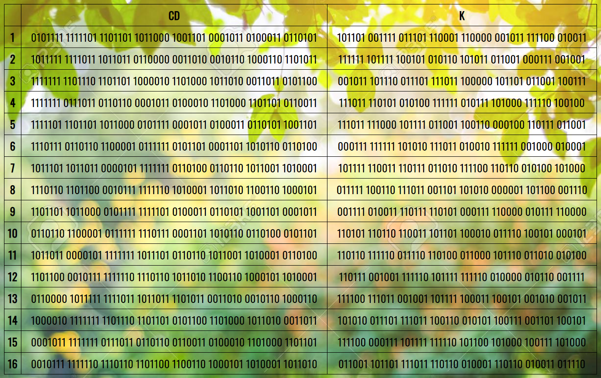

- [x] @mentions, #refs, [links](), **formatting**, and <del>tags</del> supported
- [x] list syntax required (any unordered or ordered list supported)
- [x] this is a complete item
- [ ] this is an incomplete item

# Task
## 1) Enter from the keyboard or randomly K+ in in hexadecimal form
## 2) Show all 16 values CD and keys K, without entered in the begining K

# [Preview (github pages)](https://daimon31999.github.io/JS-DES-part2/)

